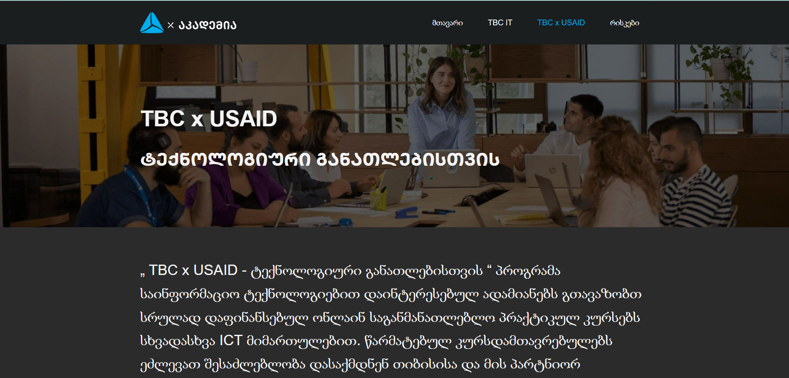

# TBC-Project
თიბისი აკადემიის ლენდინგ ფეიჯი - დავალება. 

[ლაივ ვერსია](https://schita01.github.io/TBC-Project/)

## პროექტის სტრუქტურა 
-----------------
- index.html
- **images**
  - img1
  - img2
  - img3
- **js**
    - swiper.js
    - carousel.js
    - main.js
- **css/**
  - styles.css (main external styles)
  - swiper.css

  
  პროექტი დაწერილია vanilla js -ზე
  პროექტი შედგება ერთი ფეიჯისაგან და შესაბამისად მას შეესაბამება ერთი index.html ფაილი
  css-ის ფაილები თავმოყრილია "css" -ფოლდერში
  ის ფაილები თავმოყრილია "js" ფოლდერში

## გამოყენებული ტექნოლოგიები

   
   
   
  HTML,  CSS,  JS

## პროექტის გაშვება ლოკალურად

#### მიყევით შემდეგ საფეხურებს.

#### დაკლონეთ რეპოზიტორი.
    git clone https://github.com/Schita01/TBC-Project.git

#### გადაინაცვლეთ პროექტის რუთ/მთავარ ფოლდერში.
    cd TBC-Project

#### გახსენით ვებსაიტი ბრაუზერში.
for Windows:
- `start index.html`

for Linux
- `xdg-open index.html`

for macOS
- `open index.html`

 ასევე პროექტის გახსნა ლოკალურად შესაძლებელია vs code -ის ლაივ სერვერის დახმარებით, ან ნაბისმიერი სხვა სერვერის გამოყენებით.
 
 გარდა ამისა შეგიძლიათ უბრალოდ index.html ის ბრაუზერში გახსნა მასზე ორჯერ დაკლიკებით.
 
